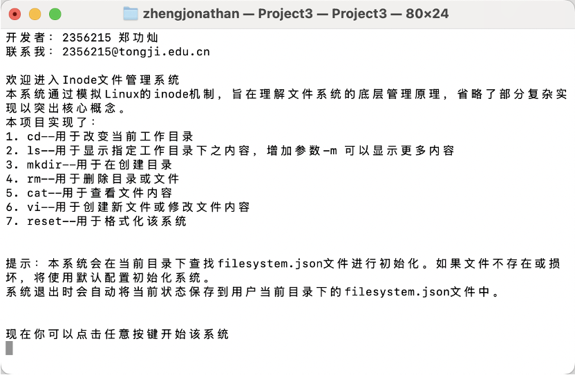
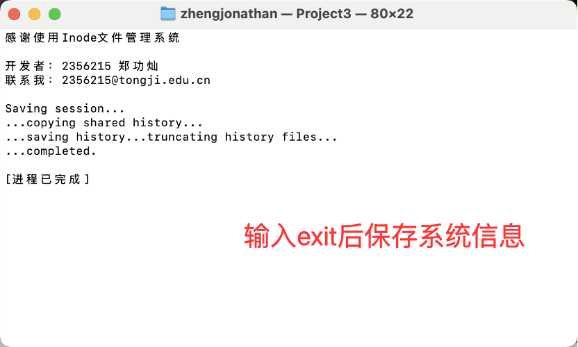

# Elevator Dispatch System

同济大学软件工程OS课设，文件系统模拟器，支持格式化，创建目录，删除目
录，显示目录，更改目录，创建文件，打开文件，关闭文件，写文件，读文
件，删除文件等功能。

## 功能介绍

* 在内存中开辟一个空间作为文件存储器，在其上实现一个简单的文件系统。
* 退出这个文件系统时，需要该文件系统的内容保存到磁盘上，以便下次可以
将其恢复到内存中来。

##  程序预览

> 
> 

## 🛠️ 技术栈

* **C++ 20**

## 🧠 使用说明

* 初始界面：介绍文件系统。
* 初始化：若无初始化文件，则进行初始化，后续可以输入指令控制该系统。
* 使用指令。
* 具体操作可见设计方案.pdf

